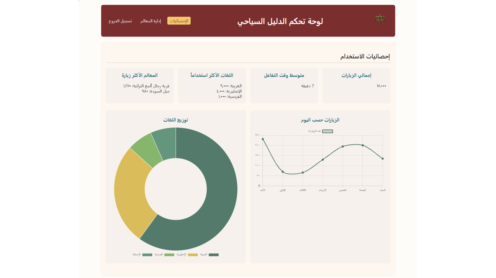
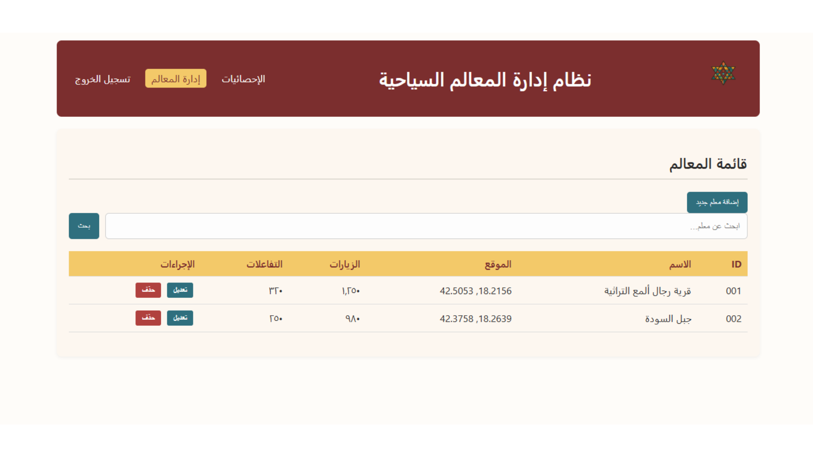
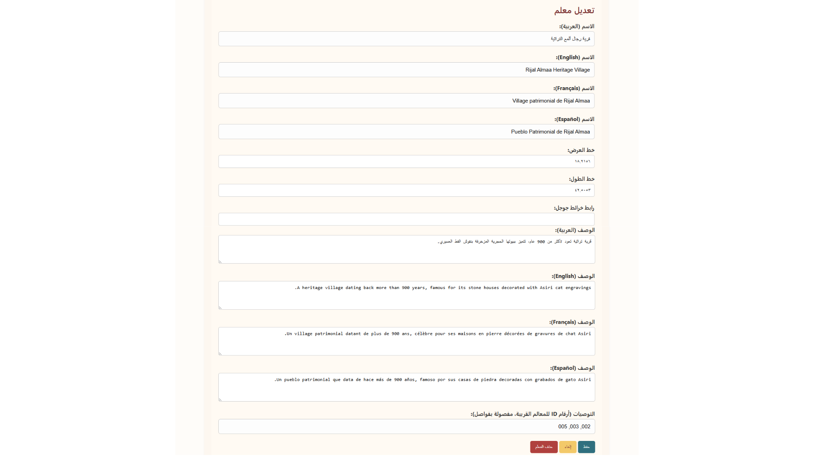
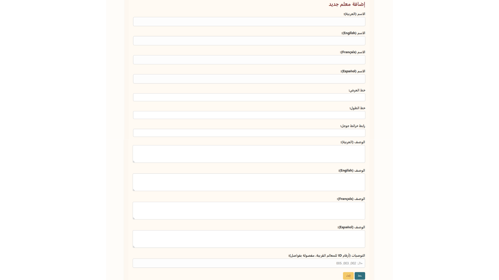

# 🧭 لوحة تحكم رِواي – الدليل السياحي الذكي لعسير

لوحة تحكم خاصة للمشرفين لإدارة محتوى الدليل السياحي الذكي لمنطقة **عسير**. توفر أدوات لإدارة المعالم، متابعة الإحصائيات، وإضافة أو تعديل المحتوى متعدد اللغات بطريقة سهلة وفعالة.

---

## 🚀 تجربة الموقع الآن

يمكنك استكشاف لوحة التحكم مباشرة عبر الرابط التالي:  
🔗 [**افتح لوحة التحكم**](https://yara-gimu.github.io/Asser_Control/index.html)

> 📌 **بيانات الدخول التجريبية:**
> - اسم المستخدم: `admin`  
> - كلمة المرور: `admin123`  
>  
> ⚠️ تأكد من إدخال البيانات أعلاه للوصول إلى لوحة التحكم.

---

## 🎯 الوظائف الأساسية

### 🔐 تسجيل دخول الأدمن
- واجهة بسيطة لإدخال اسم المستخدم وكلمة المرور.
- تحكم آمن ومباشر بالوصول إلى لوحة التحكم.

### 📊 لوحة التحكم الرئيسية
- **إحصائيات الاستخدام**:
  - إجمالي الزيارات
  - متوسط وقت التفاعل
  - اللغات المستخدمة

- **المعالم الأكثر زيارة**:

- **تحليلات يومية وتوزيع حسب اللغة**

### 🗺️ إدارة المعالم
- عرض قائمة المعالم مع إمكانية تعديل بيانات كل معلم سياحي.
- دعم كامل للغات:
  - 🇸🇦 العربية
  - 🇬🇧 English
  - 🇫🇷 Français
  - 🇪🇸 Español
- بيانات كل معلم تشمل:
  - الاسم متعدد اللغات
  - الإحداثيات (خط العرض وخط الطول)
  - وصف ثقافي وسياحي
  - توصيات بزيارة معالم قريبة
  - رابط خريطة Google

### ➕ إضافة معلم جديد
- نموذج إدخال بيانات شامل يدعم نفس الحقول الموجودة في التعديل.

---

## 🖼️ لقطات من لوحة التحكم

### 🟦 تسجيل دخول الأدمن

### 🏠 الصفحة الرئيسية - الإحصائيات والتحكم

### 📋 صفحة قائمة المعالم

### ✏️ تعديل معلومات معلم سياحي

### ➕ إضافة معلم جديد

---

## 🏞️ عن رِواي

**رِواي** هو مرشد ذكي مدعوم بالذكاء الاصطناعي، يقدم للزوار تجربة تفاعلية لاستكشاف كنوز عسير الثقافية والسياحية بلغات متعددة، مع دعم خاص لذوي الاحتياجات، وسرد قصصي صوتي للمعالم، وإمكانية مشاركة لحظات الزوار.

---

## ⚙️ التقنيات المستخدمة

- HTML / CSS / JavaScript
- LocalStorage لتخزين البيانات مؤقتًا
- واجهات بسيطة دون إطار عمل خارجي
- دعم تعدد اللغات والتحكم في المحتوى
